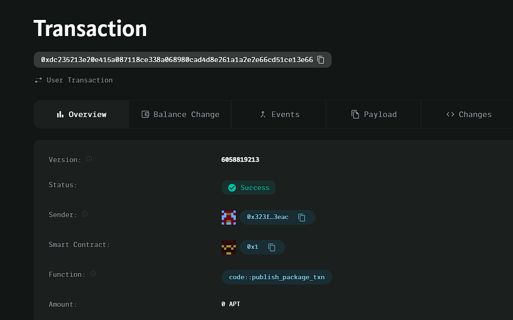

### Deployed smartcontract address: 0xdc235213e20e415a087118ce338a068980cad4d8e261a1a2e2e66cd51ce13e66

### Screenshot:

# Charity Support Platform

## Project Title
Charity Support Platform

## Project Description
The Charity Support Platform is a decentralized application (dApp) that enables users to donate a portion of their income or transaction amounts directly to charities. The platform ensures transparency and tracks all donations and fund usage on the blockchain, providing a secure, trustless environment for charitable giving.

## Vision
Our vision is to simplify the process of donating to charity by leveraging blockchain technology, providing a transparent and efficient way to ensure that donations reach their intended recipients and are used responsibly. By allowing users to contribute a portion of their transactions, we aim to make charitable giving more accessible and trustworthy.

## Key Features
- **Direct On-Chain Donations**: Users can donate a portion of their income or transactions directly to charities through smart contracts.
- **Transparent Donation Tracking**: All donations and fund movements are recorded on the blockchain, ensuring full transparency and accountability.
- **Secure Payments**: Donations are processed via smart contracts, ensuring the security and accuracy of every transaction.
- **Charity Creation**: Organizations can create a charity on-chain and start receiving donations from users.

## Future Scope
- **Recurring Donations**: Implement a recurring donation feature that allows users to set up periodic donations to their preferred charities.
- **Donation Matching**: Enable corporate matching programs where businesses can match employee donations automatically.
- **Multi-Token Support**: Expand the platform to accept various tokens and cryptocurrencies for donation.
- **Charity Verification System**: Build a verification system to ensure that charities are legitimate and provide transparency into how donations are being used.
- **Global Charity Network**: Integrate with international charity networks to broaden the reach and impact of the platform.

